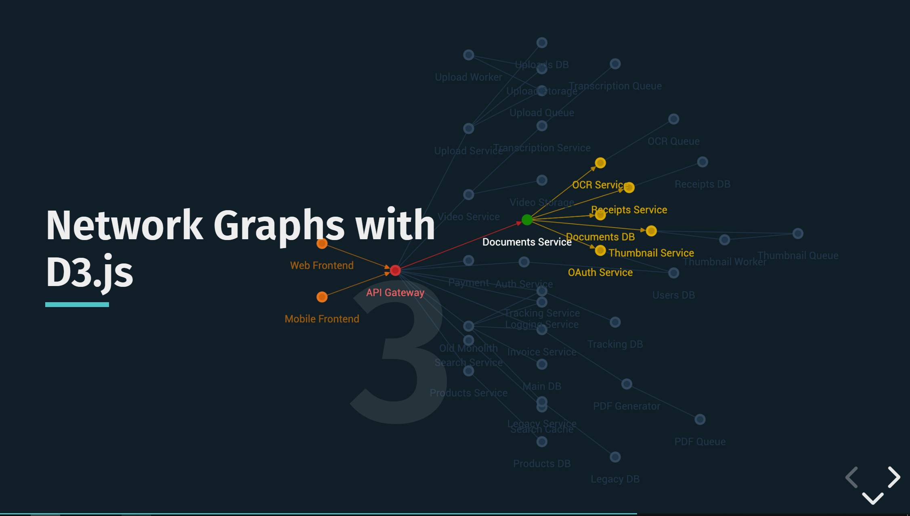

# Visualizing cloud architectures in real time with d3.js

These are my slides including links to images and documentations for my talk from:

**WorkerConf**  
28 June 2019  
Dornbirn, Austria

**[View Slides Online &rarr;](https://julie-ng.github.io/workerconf-slides)**

### Preview

### Abstract

If you have multiple development teams, your cloud architecture probably feels organic changing with agile development cycles. We may ship faster and scale faster. But we can also get lost more easily as complexity grows. Automated monitoring tools come at the price of information overload.

Let's bring some clarity back into the picture by filtering out the technical noise to see how cloud architectures were designed to behave. We'll create our our own microservice architecture visualization frontend using d3.js. Then we'll integrate some backend monitoring, sprinkle in some animation with JS and CSS, and voilà - we can watch how our architecture dances - in real time!

### Template

This is a custom reveal.js template and threw together with Gulp. It will be open sourced soon :)

